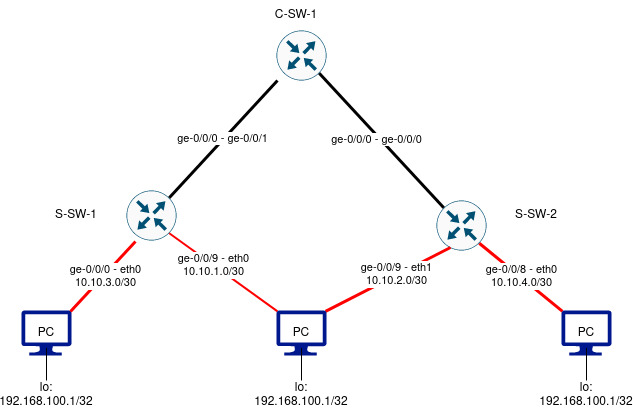

# Anycast load balancing #

In a previous [document](https://github.com/vsi-fi/network-stuff/tree/main/host-ecmp-multihoming) i tested multihoming of service address using BGP.

To exploit this concept further i wanted to apply the similar concept to load balancing using anycast.

## Concept and building blocks ##

Similar to the multi homing i will be using bird to announce the service address but this time from multiple hosts.
This is actually very minor change to the setup on the previously mentioned lab:

* Add couple of more PCs to the lab on different subnets.
* Configure service address on the hosts
* Configure link networks and advertise the service address.
* Enable multipathing for BGP.
  * if using different AS numbers for PCs then add multiple-as as well.

Similarly to the previously mentioned [document](https://github.com/vsi-fi/network-stuff/tree/main/host-ecmp-multihoming) the red lines indicate eBGP and black lines are IGP.
I've added two machines on two new subnets, 10.10.3.0/30 and 10.10.4.0/24, both have the same service address in their loopback as original pc in the middle: 192.168.100.1/32.
Hosts will also similarly advertise the said address to the devices who in turn will have their multipath -knob turned on for the BGP so that we can have multiple BGP learned paths to the same destination service address. 
This, together with equal cost multipathing (ECMP) allows for load balancing from the direction of the rest of the network and quick failovers if the advertisement is withdrawn.

## Configuring hosts ##

Bird is configured (per default) via file /etc/bird.conf

    router id 10.10.3.2;

    protocol kernel {
        #dont remove routes from the table if bird is killed
        persist;
        #scan kernel table for routes to import into bird
        scan time 10;
        #This knob allows for ECMP, e.g. active-active when routes are imported to kernel table
        merge paths on;
        ipv4 {
            import all;  
            export all;
        };
    }

    protocol device {
        interface "eth*";
        scan time 3;
    }

    protocol direct {
        ipv4;
        interface "lo";
        interface "dummy0";
        interface "eth0";
        interface "eth1";
    }

    filter service_address {
        #I want to export only the service route
        if (net = 192.168.100.1/32) then {
            accept;
        }
        else reject; 
    }

    #this time we advertise to only one switch
    #i am lazy and i'll import whatever the switch decides to give me, in reality filtering is highly recommended
    protocol bgp sw_sw_1 {
        local as 65000;
        neighbor 10.10.1.1 as 65001;
        ipv4 {
            export filter service_address;
            import all;
        };
    }

Bird configured we still need to configure the network interfaces on the host:

    cat /etc/network/interfaces 
    auto lo
    iface lo inet loopback

    iface lo inet static
        address 127.0.0.1
        netmask 255.0.0.0 

    iface lo inet static
        address 192.168.100.1
        netmask 255.255.255.255

    auto eth0
    iface eth0 inet static
        address 10.10.3.2
        broadcast 10.10.3.3
        netmask 255.255.255.252

And add bird to run at boot time followed by a reboot

    LB-1:~# rc-update add bird

## Configuring the network devices ##

    root@S-SW-1> show configuration interfaces ge-0/0/8  
    unit 0 {
        family inet {
            address 10.10.3.1/30;
        }
    }

    root@S-SW-1> show configuration protocols bgp   
    group SERVER {
        type external;
        passive;
        import IMPORT-BGP-SERVERS;
        export EXPORT-BGP-SERVERS;
        peer-as 65000;
        local-as 65001;
        multipath;
        neighbor 10.10.1.2;
        neighbor 10.10.3.2;
    }

You can look up the contents of the routing policies from [here](https://github.com/vsi-fi/network-stuff/tree/main/host-ecmp-multihoming#configuring-the-network-devices)

Key element here is the multipath -knob as it allows for load sharing between multiple eBGP paths to the same prefix, in this case the service address.

## Verification ##

We can verify that the load sharing towards the destination is enabled by querying the routing/forwarding tables of a switch:

    root@S-SW-1> show route 192.168.100.1 table inet.0 

    inet.0: 10 destinations, 13 routes (10 active, 1 holddown, 0 hidden)
    Limit/Threshold: 1048576/1048576 destinations
    @ = Routing Use Only, # = Forwarding Use Only
    + = Active Route, - = Last Active, * = Both

    192.168.100.1/32   *[BGP/90] 00:26:01, localpref 100
                          AS path: 65000 I, validation-state: unverified
                           to 10.10.1.2 via ge-0/0/9.0
                        >  to 10.10.3.2 via ge-0/0/8.0
                        [BGP/90] 00:26:01, localpref 100
                          AS path: 65000 I, validation-state: unverified
                        >  to 10.10.1.2 via ge-0/0/9.0
                        [OSPF/150] 00:25:59, metric 0, tag 0
                        >  to 10.1.1.3 via ge-0/0/0.0

    root@S-SW-1> 

Routes are visible, including the OSPF route from the other switch. Lets double check by querying the forwarding-table:

    root@S-SW-1> show route forwarding-table destination 192.168.100.1 192.168.100.1 table default   
    Routing table: default.inet
    Internet:
    Destination        Type RtRef Next hop           Type Index    NhRef Netif
    192.168.100.1/32   user     0                    ulst  1048575     2
                                 10.10.1.2          ucst      624     4 ge-0/0/9.0
                                 10.10.3.2          ucst      629     4 ge-0/0/8.0

    root@S-SW-1> 

If I commit the below things will take a step back in terms of load balancing:

    root@S-SW-1# show|compare 
    [edit protocols bgp group SERVER]
    !      inactive: multipath { ... }

    [edit]
    root@S-SW-1# commit and-quit

We can still see all the routes:

    root@S-SW-1> show route 192.168.100.1 table inet.0                          

    inet.0: 10 destinations, 13 routes (10 active, 1 holddown, 0 hidden)
    Limit/Threshold: 1048576/1048576 destinations
    @ = Routing Use Only, # = Forwarding Use Only
    + = Active Route, - = Last Active, * = Both

    192.168.100.1/32   *[BGP/90] 00:01:14, localpref 100
                          AS path: 65000 I, validation-state: unverified
                        >  to 10.10.3.2 via ge-0/0/8.0
                        [BGP/90] 00:30:23, localpref 100
                          AS path: 65000 I, validation-state: unverified
                        >  to 10.10.1.2 via ge-0/0/9.0
                        [OSPF/150] 00:30:21, metric 0, tag 0
                        >  to 10.1.1.3 via ge-0/0/0.0

    root@S-SW-1> 

But the active route is via ge-0/0/8.0. For this use case multipath -knob makes sense.

## Further topics ##

If one wanted to use different AS numbers on the PCs then this patch might be required:

    root@S-SW-1# show|compare 
    [edit protocols bgp group SERVER multipath]
    +     multiple-as;

    [edit]

It does just that by disabling the default behavior of requiring the same neighbor AS.
 
