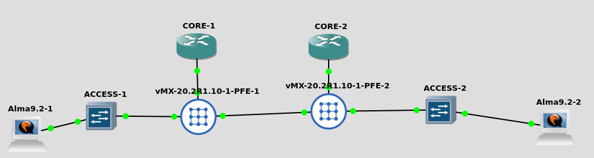

# Simple multi field classifier with DSCP #

Configure a trivial DSCP marking based on multi field classifier and verify markings on the end hosts.

## Topology and the gear used ##

2x VMX 21.4R1.12
2x vJunos/EX9214/23.2R1.14
2x Virtual machines



## Configuration on the core ##

```
root@CORE-1# show class-of-service    
classifiers {
    dscp UPLINK-CLASSIFIER {
        forwarding-class ICMP {
            loss-priority high code-points be;
        }
        forwarding-class TCP-INTERACTIVE {
            loss-priority low code-points ef;
        }
    }
}
forwarding-classes {
    class ICMP queue-num 2 priority low policing-priority normal;
    class TCP-INTERACTIVE queue-num 3 priority high policing-priority premium;
}
interfaces {
    ge-0/0/0 {
        unit 0 {
            classifiers {
                dscp UPLINK-CLASSIFIER;
            }
            rewrite-rules {
                dscp UPLINK-RWR;
            }
        }                               
    }
    ge-0/0/9 {
        unit 0 {
            classifiers {
                dscp UPLINK-CLASSIFIER;
            }
            rewrite-rules {
                dscp UPLINK-RWR;
            }
        }
    }
}
rewrite-rules {
    dscp UPLINK-RWR {
        forwarding-class ICMP {
            loss-priority high code-point be;
            loss-priority low code-point be;
        }
        forwarding-class TCP-INTERACTIVE {
            loss-priority high code-point ef;
            loss-priority low code-point ef;
        }
    }                                   
}
scheduler-maps {
    LAB {
        forwarding-class ICMP scheduler ICMP;
        forwarding-class TCP-INTERACTIVE scheduler TCP-INTERACTIVE;
    }
}
schedulers {
    ICMP {
        transmit-rate percent 20;
        buffer-size {
            remainder;
        }
        priority low;
    }
    TCP-INTERACTIVE {
        transmit-rate percent 15;
        buffer-size percent 10;
        priority high;
    }
}

[edit]
```

Basically COS is enabled on the links between the vMX and the vJunos boxes based on DSCP marking where ICMP traffic should stay in queue 2 and 'interactive tcp' is kept in queue 3. Core devices do not implement multi field classifiers, but instead they rely on this taking place at the edge devices. E.g. behavior aggregate in Juniper parlance. 

 
## Configuration on the access ##

Access device is basically configured similarly:

```
root@ACCESS-1# show 
classifiers {
    dscp UPLINK-CLASSIFIER {
        forwarding-class ICMP {
            loss-priority high code-points be;
        }
        forwarding-class TCP-INTERACTIVE {
            loss-priority low code-points ef;
        }
    }
}
forwarding-classes {
    class ICMP queue-num 2 priority low;
    class TCP-INTERACTIVE queue-num 3 priority high;
}
interfaces {
    ge-* {
        scheduler-map LAB;
    }
    ge-0/0/0 {
        scheduler-map LAB;
        unit * {
            classifiers {
                dscp UPLINK-CLASSIFIER;
            }                           
            rewrite-rules {
                dscp UPLINK-RWR;
            }
        }
    }
}
rewrite-rules {
    dscp UPLINK-RWR {
        forwarding-class ICMP {
            loss-priority low code-point be;
        }
        forwarding-class TCP-INTERACTIVE {
            loss-priority low code-point ef;
        }
    }
}
scheduler-maps {
    LAB {
        forwarding-class ICMP scheduler ICMP;
        forwarding-class TCP-INTERACTIVE scheduler TCP-INTERACTIVE;
    }
}
schedulers {                            
    ICMP {
        transmit-rate percent 20;
        buffer-size {
            remainder;
        }
        priority low;
    }
    TCP-INTERACTIVE {
        transmit-rate percent 15;
        buffer-size percent 10;
        priority high;
    }
}

[edit class-of-service]
```
However, there is one extra bit of config in the access devices when it comes to the host-facing ports.

```
root@ACCESS-1# show interfaces ge-0/0/9  
unit 0 {
    family ethernet-switching {
        vlan {
            members VLAN101;
        }
        filter {
            input INPUT-CLASSIFIER;
        }
    }
}
```
There is firewall filter configured on the host-facing port that is supposed to take care of the multi field classification:

```
root@ACCESS-1# ...hernet-switching filter INPUT-CLASSIFIER                    
term ICMP {
    from {
        ip-protocol icmp;
    }
    then {
        forwarding-class ICMP;
        count ICMP;
    }
}
term TCP-INTERACTIVE {
    from {
        destination-port ssh;
        ip-protocol tcp;
    }
    then {
        accept;
        forwarding-class TCP-INTERACTIVE;
        loss-priority low;
        count TCP-INTERACTIVE;
    }
}
term DEFAULT {
    then accept;
}                                       

[edit]
```
However, while the above filter seemingly successfully put the traffic to correct queues for whatever reason, the DSCP markings where not seen on the core side. I spend hours trying to understand what was happening but in the end I failed to get this working. Instead, I deployed the following:

```
root@ACCESS-1# show interfaces irb   
unit 101 {
    family inet {
        filter {
            input L3-CLASSIFIER;
        }
        address 192.168.101.1/24;
    }
}

[edit]
root@ACCESS-1# show firewall family inet filter L3-CLASSIFIER 
term TCP-INTERACTIVE {
    from {
        protocol tcp;
        destination-port ssh;
    }
    then {
        count L3-TCP-INTERACTIVE;
        loss-priority low;
        forwarding-class TCP-INTERACTIVE;
    }
}
term ICMP {
    from {
        protocol icmp;
    }
    then forwarding-class ICMP;
}
term DEFAULT {
    then accept;
}

[edit]
```
E.g. functionally similar firewall filter on the L3 interface. With this configured, the DSCP markings were seen. Maybe there is some bug with the L2 filter or I somehow failed to configure this properly?

## Verification ##

Whilst investigating the above, I added the below filter on the core:

```
root@CORE-1# show interfaces ge-0/0/0   
interface-transmit-statistics;
unit 0 {
    family inet {
        filter {
            input COS-DEBUG;
        }
        unnumbered-address lo0.0;
    }
}

[edit]
root@CORE-1# show firewall family inet filter COS-DEBUG 
term ICMP {
    from {
        dscp be;
    }
    then count ICMP-DSCP;
}
term TCP-INTERACTIVE {
    from {
        dscp ef;
    }
    then count TCP-INTERACTIVE;
}
term AF11 {
    from {
        dscp af11;
    }
    then count AF11;
}
term DEFAULT {
    then accept;
}

[edit]
```

Initially all traffic seemed to hit only the ICMP-DSCP, e.g. best-effort. After the switch from L2 to L3 classifier on the access I started to see the expected markings:

```
root@CORE-1# run show firewall filter COS-DEBUG 

Filter: COS-DEBUG                                              
Counters:
Name                                                Bytes              Packets
AF11                                                    0                    0
ICMP-DSCP                                        15778247               294345
TCP-INTERACTIVE                                     32056                  598

[edit]
root@CORE-1# 
```

One can also verify the expected behavior from the hosts by running tcpdump and monitoring the ToS field:

```
[root@CLIENT-2 ~]# tcpdump -vv -i ens3 -c 1 icmp
[  244.085549] device ens3 entered promiscuous mode
dropped privs to tcpdump
tcpdump: listening on ens3, link-type EN10MB (Ethernet), snapshot length 262144 bytes
09:06:42.415991 IP (tos 0x0, ttl 60, id 15749, offset 0, flags [DF], proto ICMP (1), length 84)
    192.168.101.254 > CLIENT-2: ICMP echo request, id 1, seq 1, length 64
1 packet captured
6 packets received by filter
```
Here we can see an incoming icmp echo request with ToS value of 0x0, eg. best-effort.

With ssh things look different:

```
[root@CLIENT-2 ~]# tcpdump -vv -i ens3 -c 1 tcp port 22
[  358.975593] device ens3 entered promiscuous mode
dropped privs to tcpdump
tcpdump: listening on ens3, link-type EN10MB (Ethernet), snapshot length 262144 bytes
09:08:39.788048 IP (tos 0xb8, ttl 60, id 13249, offset 0, flags [DF], proto TCP (6), length 60)
    192.168.101.254.50150 > CLIENT-2.ssh: Flags [S], cksum 0x377f (correct), seq 1777770379, win 64240, options [mss 1460,sackOK,TS val 3211213405 ecr 0,nop,wscale 6], length 0
1 packet captured
5 packets received by filter
0 packets dropped by kernel
[  367.002946] device ens3 left promiscuous mode
```

ToS field has the value of 0xb8 indicating that the DSCP marking is doing its thing. 
