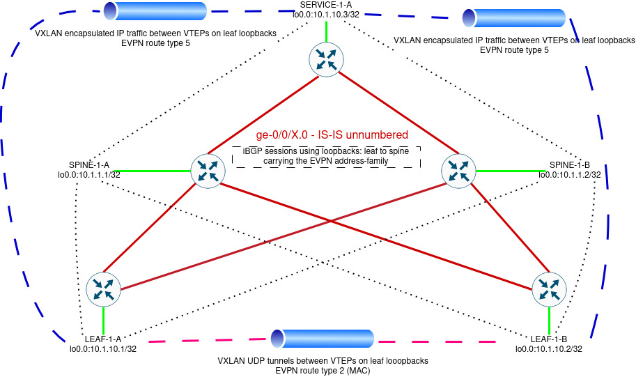

# EVPN overlay using iBGP #

## Overview ##

Once the underlay is somehow implemented it is time to give a shot at building the overlay that actually handles/builds the virtual extensible LANs or VXLANs.
VXLAN is a tunneling subsystem that on its basic level allows the encapsulation of Ethernet frames to a IP/UDP packets. For better or worse, this allows the OSI data link layer traffic to cross OSI network layer boundaries. 
VXLAN itself does not produce a so called control plane that would allow the devices involved to learn of each other not to mention what devices need to receive which traffic.

There are few different solutions to this:
* VXLAN controllers, proprietary or otherwise
* Multicast - devices interested in certain traffic join traffic specific multicast groups to receive 'flooding'
* Static configuration

However, in this lab I want to use multi protocol BGP, MP-BGP, with the address family EVPN.
In our setup this control plane (EVPN) is responsible for address learning. For example, devices learn the mac-addresses found behind other devices from EVPN signaled routes instead of flooding as is the case with the classic Ethernet mac learning or with VPLS.
This approach also allows for overlapping IP addressing between 'tenants' and in some cases overlapping VLAN id.
Control plane also allows for 'flexible' route filtering with a construct called 'route-target' as we'll discover later on.

## Reasoning ##

Similarly to the underlay, there are different options of implementing the EVPN signaling on the overlay. My understanding is that the first question to answer here is whether to use eBGP or iBGP?

In my simple lab scenario I've decided to go with iBGP as the scale is extremely limited and with just few adjustments we can have a working system with less config that eBGP would require:

* Single autonomous system (AS) number is required.
* No need to manipulate AS loop detection (allow-as-in, as-overrides etc.).
* All leaf devices in a 'pod' can establish BGP sessions to same IP addresses, e.g. no link specific peering config required.

That being said, this approach also has at least few caveats:

* This approach uses route-reflectors at the spine.
* Scaling is more limited to what could be achieved by using eBGP.

## Topology ##

Underlay is represented by the red lines on physical links on which IS-IS is running in point-to-point mode to advertise the loopback addresses on the green lines.
More details about the underlay available [here](https://github.com/vsi-fi/network-stuff/blob/main/evpn/is-is-underlay.md)

Black dotted lines are the iBGP sessions from the leaf devices to the spines on which the route reflectors (RRs) are running. 
These iBGP sessions will carry the evpn address-family which is used as a control plane for VXLAN.

In the above picture the pink dotted lines represent L2 traffic between the leafs whereas blue dotted line represents L3 traffic between different VRF instances.
It should be noted that the virtual tunnel endpoints (VTEPs) are listening on the loopback interfaces of the leafs.

## Configuring basic iBGP ##

The default rule of iBGP is to *not* advertise the routes learned from other iBGP speakers on wards to other iBGP speakers. Meaning, that a full mesh of iBGP sessions is expected within a iBGP domain.
This obviously can create scaling issues if the number of routers involved is significant. To solve this scaling issue and the complex configuration required I am going to use an iBGP feature called route-reflection.
Route reflectors (RRs) break the aforementioned fundamental iBGP rule and this simplifies the configuration quite significantly and is justifiable in a data centre environment where EVPN is used.

The iBGP config on the spine device could look like this:

    root@SITE-1-SPINE-1-A> show configuration protocols bgp   
    group OVERLAY {
        apply-groups iBGP-AUTH;
        type internal;
        local-address 10.1.1.1;
        passive;
        family evpn {
            signaling;
        }
        cluster 10.1.1.0;
        local-as 65001;
        allow 10.1.10.0/24;
}

The above construct creates a template for neighbors that are treated similarly:

* Neighbors are considered as iBGP type.
* Device is using its loopback address to source the BGP connections.
* Device is not actively connecting to neighbors, but instead it passively waits for the neighbor to connect.
* At its simplest, on the spine we just need to enable the EVPN address family.
* Cluster tells the spine to act as a RR, we want to add both spines in to the same cluster.
* Local-as is what the device is using and also expects to see from the neighbors.
* Spine accepts new neighbors from he 10.1.10.0/24 subnet which is the subnet from which the loopbacks of the leafs are allocated.

The apply-group iBGP-AUTH applies authentication for the BGP sessions:

    root@SITE-1-SPINE-1-A> show configuration groups iBGP-AUTH 
    protocols {
        bgp {
            group <*> {
                authentication-algorithm aes-128-cmac-96;
                authentication-key-chain iBGP-AUTH;
            }
        }
    }

Which in turn relies on the key-chain:

    root@SITE-1-SPINE-1-A> show security authentication-key-chains                      
    key-chain iBGP-AUTH {
        tolerance 600;
        key 0 {
            /* Password: iBGP-PASSWORD */
            secret "$9$NidwgaJUmPT1RLx7NsYg4aUkmTznuBRxNiq.PzF"; ## SECRET-DATA
            start-time "2023-11-20.06:10:00 +0000";
        }
    }

The above forces the authentication of BGP messaging and would hopefully prevent accidental BGP sessions from forming.
One could add more keys with different start times to improve this aspect. Also, the tolerance -knob dictates the number of allowed clock skew in seconds, this maybe should be something else than 600 seconds.

Configuration on the leaf devices is basically the same, except we explicitly configure the neighbor addresses (spine loopbacks)

    root@SITE-1-LEAF-1-A> show configuration protocols bgp   
    group OVERLAY {
        apply-groups iBGP-AUTH;
        type internal;
        local-address 10.1.10.1;
        family evpn {
            signaling;
        }
        local-as 65001;
        neighbor 10.1.1.1;
        neighbor 10.1.1.2;
    }

## Verifying basic iBGP ##

First, check the status of any possibly connected neighbors on the spine:

    root@SITE-1-SPINE-1-A> show bgp summary 

    Warning: License key missing; requires 'bgp' license

    Threading mode: BGP I/O
    Default eBGP mode: advertise - accept, receive - accept
    Groups: 1 Peers: 2 Down peers: 0
    Unconfigured peers: 2
    Table          Tot Paths  Act Paths Suppressed    History Damp State    Pending
    bgp.evpn.0           
                          20         20          0          0          0          0
    inet.0               
                       0          0          0          0          0          0
    Peer                     AS      InPkt     OutPkt    OutQ   Flaps Last Up/Dwn State|#Active/Received/Accepted/Damped...
    10.1.10.1             65001         13         11       0       0        1:35 Establ
      bgp.evpn.0: 10/10/10/0
    10.1.10.2             65001         13         12       0       0        1:35 Establ
      bgp.evpn.0: 10/10/10/0

    root@SITE-1-SPINE-1-A> 

From the above we can see that both leaf devices have successfully connected even with the messy authentication being enforced upon them.

As shown in the above snippet, there are no IPv(4|6) routes learned. This is expected on the spine, but one could look at what a given neighbor advertising:

    root@SITE-1-SPINE-1-A> show route receive-protocol bgp 10.1.10.1 table inet.0
    
However, the things look bit different when looking at EVPN:

    root@SITE-1-SPINE-1-A> show route receive-protocol bgp 10.1.10.1 table table bgp.evpn.0

    Warning: License key missing; requires 'bgp' license

    bgp.evpn.0: 20 destinations, 20 routes (20 active, 0 holddown, 0 hidden)
      Prefix                  Nexthop              MED     Lclpref    AS path
      1:10.1.10.1:0::01000000000001000a00::FFFF:FFFF/192 AD/ESI            
    *                         10.1.10.1                    100        I
      1:10.1.10.1:0::05000000000000271a00::FFFF:FFFF/192 AD/ESI            
    *                         10.1.10.1                    100        I
      1:10.1.10.1:100::01000000000001000a00::0/192 AD/EVI            
    *                         10.1.10.1                    100        I
      2:10.1.10.1:100::10010::00:00:5e:00:01:01/304 MAC/IP            
    *                         10.1.10.1                    100        I
      2:10.1.10.1:100::10010::2c:6b:f5:f3:55:f0/304 MAC/IP            
    *                         10.1.10.1                    100        I
      2:10.1.10.1:100::10010::00:00:5e:00:01:01::192.168.10.1/304 MAC/IP            
    *                         10.1.10.1                    100        I
      2:10.1.10.1:100::10010::2c:6b:f5:f3:55:f0::192.168.10.11/304 MAC/IP            
    *                         10.1.10.1                    100        I
      3:10.1.10.1:100::10010::10.1.10.1/248 IM                
    *                         10.1.10.1                    100        I
      4:10.1.10.1:0::01000000000001000a00:10.1.10.1/296 ES                
    *                         10.1.10.1                    100        I
      5:10.1.1.1:310::0::192.168.10.0::24/248                   
    *                         10.1.10.1                    100        I

    root@SITE-1-SPINE-1-A> 
 
So what are the leaf devices actually doing? Lets try to find out.

## Adding EVPN to the mix ##

The 'magic' of EVPN happens on the leaf devices using virtual routing and forwarding instances (VRFs).
VRF could be considered as a virtual instance of a device with its own mac, arp|nd, route -tables and various other things such as dhcp-relay configs etc.
In Juniper lingo VRF is type of a routing-instance. There are few different types of routing-instances such as:

* forwarding
* virtual-router
* VPLS
* and numerous others

All of the routing-instance types have their use cases, so more esoteric than others.

## Building blocks ##

There are most likely numerous other ways to implement this scenario but I've opted to use mac-vrf and vrf.
The two routing-instance types share couple of common aspects to them with different payloads among which I'd highlight the following:

* **route-distinguisher:** To keep the route advertisements unique even if they'd contain overlapping information (between instances), such as subnets, mac-address etc. 
* **route-target:** Is used to 'import' and 'export' routes from/to VRF instance. Route target is a BGP community on which filter can be based on. 

### mac-vrf ###

As the name suggest, mac-vrf instance type can carry MAC-address information. According to Juniper this instance type allows for "multiple customer-specific EVPN instances (EVIs), each of which can support a different EVPN service type."
At the moment there are three service types available:

* **vlan-based:** This type of service has one VRF per VLAN, this can be quite efficient in terms of controlling flooding but also resource and config intensive.
* **vlan-bundle:** I think of this as a QinQ of EVPN where it is possible to have multiple VLANs sharing the same bridging table.
* **vlan-aware**: This allows mapping of multiple VLANs with each having their own bridging table to a same VRF. It is also the service type I opted for in this lab. 

In this lab my plan was to have a single L2 VRF representing all of the VLANs in the 'site'. This means that there cannot be overlapping VLAN ids on tenants but overlapping mac-addresses are OK (think of vrrp mac for instance).

### vrf ###

If one were to configure VLANs, IRB interfaces and such constructs they and up in the default routing instance per default. To create separation between 'tenants' we can use routing-instance type 'vrf'.
Each VRF has its own routing-table, arp|nd -table etc. VRF instance can also run routing protocols, dhcp relays and other services.

## Configuring basic EVPN ##

Below is an example of a **mac-vrf** (L2) instance:

    root@SITE-1-LEAF-1-A> show configuration routing-instances SITE-1-L2  
    instance-type mac-vrf;
    protocols {
        evpn {
            encapsulation vxlan;
            multicast-mode ingress-replication;
        }
    }
    vtep-source-interface lo0.0;
    service-type vlan-aware;
    interface ae9.0;
    route-distinguisher 10.1.10.1:100;
    vrf-target target:65001:100;
    vlans {
        VLAN10 {
            vlan-id 10;
            l3-interface irb.10;
            ##
            ## Warning: requires 'vxlan' license
            ##
            vxlan {
                vni 10010;
            }
        }
    }                                   

We need to define the **encapsulation** used for the instance type. In our case VXLAN is really the only option, but others are also available, such as MPLS.
The **multicast-mode** -knob determines the method that is applied to handling multicast, unknown unicast and broadcast (BUM) traffic.
I am opting for ingress-replication here, which I consider as a 'converter' of BUM traffic to known unicast.

In practice this means that a device receiving BUM traffic sends unicast packets to all other devices interested in the same virtual network identifier (VNI).
The 'interest' is determined based on the route advertisements received, this keeps the unicast traffic being sent to device who do not advertise the said VNI to RRs.
To be more precise, the EVPN route-type 3, inclusive multicast Ethernet tag, IMET routes are used to determine this.

We also need to define the **vtep-source-interface** this defines the address that is used to send the vxlan encapsulated traffic. 
It is reasonably good idea to use the loopback interface for this as it is 'always up' and hopefully reachable over the underlay.
As described, we need to define the **service-type**, like said I opted for a single side-wide mac-vrf.

Each physical interface on which downstream devices connect have to be assigned to the mac-vrf, here I am adding the ae9 as a member interface.
Next, we defined the **route-distinguisher**. I opted to use the loopback address of the LEAF-1-A and the 'instance number' of 100.
This way I can quickly determine from which device the route originated from (this info would also be available via BGP Origin attribute), including the 'instance' in which the route belongs to.

**vrf-target** is a reference to a route-target that determines which routes to import to the vrf instance.

**vlans** are configured in a different place than usual as they are defined under the routing-instance and not directly to the [ vlans ] -hierarchy. Configuration itself is similar except for the **vxlan**.
Vxlan section needs the virtual network identifier (VNI) which as to be unique per VLAN.

Below is an example of a **vrf** (L3) instance:

    root@SITE-1-LEAF-1-A> show configuration routing-instances SITE-1-TENANT-1 
    instance-type vrf;
    protocols {
        evpn {
            ip-prefix-routes {
                advertise direct-nexthop;
                encapsulation vxlan;
                vni 310;
            }
        }
    }
    interface irb.10;
    route-distinguisher 10.1.1.1:310;
    vrf-import VRF-IMPORT-SITE-1-TENANT-1;
    vrf-target target:65001:310;

Configuration is quite similar to the L2 mac-vrf. However there are few key differences:

* **instance-type**: vrf, we're building a L3 instance.
* **ip-prefix-routes**: This bit tells the device to advertise 'tenant' specific routes to EVPN using route-type 5.
    * **advertise-direct-next-hop**: This allows for pure type 5 routes without co-existing type 2 route for L2.
    * **encapsulation**: as was the case with the mac-vrf, we're using vxlan.
    * **vni**: This is the 'customer number' of the 'tenant' to which the routes belong to.
* **interface**: we can assign L3 interfaces here.
* **vrf-import** : this statement allows for a policy to be applied in order to determine which routes to import to the vrf.

Policies are configured as follows:

    root@SITE-1-LEAF-1-A> show configuration policy-options policy-statement VRF-IMPORT-SITE-1-TENANT-1
    term SERVICE {
        from community SITE-1-SERVICE-1;
        then accept;
    }
    term SITE-1-TENANT-1 {
        from community SITE-1-TENANT-1;
        then accept;
    }

The above mentioned communities are defined as below:  

    community SITE-1-SERVICE-1 members target:65001:3100;
    community SITE-1-TENANT-1 members target:65001:310;

With the above policy we can not only import routes from other devices who are advertising the same route-target but also routes using other route-target.
This allows for a 'hub-and-spoke' where a common 'service-vrf' can be shared between the 'tenants' whilst the tenants do not see each others routes.

## Verifying EVPN on the core ##

From the BGP section we already know that the evpn table is being populated. Lets try to understand the differences to classical mac learning from the mac-table perspective:

    root@SITE-1-LEAF-1-A> show ethernet-switching table brief      
    Ethernet switching table : 2 entries, 2 learned
    Routing instance : SITE-1-L2
       Vlan                MAC                 MAC       GBP    Logical                SVLBNH/      Active
       name                address             flags     tag    interface              VENH Index   source
       VLAN10              00:00:5e:00:01:01   DRP              esi.666                             05:00:00:00:00:00:00:27:1a:00 
       VLAN10              0c:ea:18:b8:00:01   DLR              ae9.0             
       VLAN10              2c:6b:f5:38:c3:f0   DR               vtep.32769                          10.1.10.2                     

    root@SITE-1-LEAF-1-A> 

Above we can see two host macs and one anycast gateway mac.
* **00:00:5e:00:01:01** This is an anycast gateway mac, think of this like vrrp next-hope but better.
* **0c:ea:18:b8:00:01** locally learned mac from link aggregate ae9
* **2c:6b:f5:38:c3:f0** mac learned from a remote device at 10.1.10.2 (LEAF-1-B)

Spine devices have no entries in their mac-tables since they do not participate in the VRFs. 

To see details concerning the **mac-address learned remotely**:

    root@SITE-1-LEAF-1-A> show route evpn-mac-address 2c:6b:f5:38:c3:f0 table SITE-1-L2.evpn.0
    SITE-1-L2.evpn.0: 27 destinations, 45 routes (27 active, 0 holddown, 0 hidden)
    + = Active Route, - = Last Active, * = Both

    2:10.1.10.2:100::10010::2c:6b:f5:38:c3:f0/304 MAC/IP        
                   *[BGP/170] 01:57:44, localpref 100
                      AS path: I, validation-state: unverified
                    >  to 10.1.1.1 via ge-0/0/0.0, Push 625
                       to 10.1.1.2 via ge-0/0/1.0, Push 625
                    [BGP/170] 01:59:05, localpref 100, from 10.1.1.2
                      AS path: I, validation-state: unverified
                    >  to 10.1.1.1 via ge-0/0/0.0, Push 625
                       to 10.1.1.2 via ge-0/0/1.0, Push 625
    2:10.1.10.2:100::10010::2c:6b:f5:38:c3:f0::192.168.10.12/304 MAC/IP        
                   *[BGP/170] 01:57:44, localpref 100
                      AS path: I, validation-state: unverified
                    >  to 10.1.1.1 via ge-0/0/0.0, Push 625
                       to 10.1.1.2 via ge-0/0/1.0, Push 625
                    [BGP/170] 01:59:05, localpref 100, from 10.1.1.2
                      AS path: I, validation-state: unverified
                    >  to 10.1.1.1 via ge-0/0/0.0, Push 625
                       to 10.1.1.2 via ge-0/0/1.0, Push 625

    root@SITE-1-LEAF-1-A> 

We can see that we have two active paths to the remote virtual tunnel endpoint (VTEP), one over each spine.
From the above routes you can see that they are route-type 2, originated from 10.1.10.2 on instance 100 on a vni 10010.
Quite informative compared to simple mac dump.

How about the routes on the **L3 vrf tables**?

    root@SITE-1-LEAF-1-A> show route table SITE-1-TENANT-1.evpn.0 

    SITE-1-TENANT-1.evpn.0: 3 destinations, 5 routes (3 active, 0 holddown, 0 hidden)
    + = Active Route, - = Last Active, * = Both

    5:10.1.1.1:310::0::192.168.10.0::24/248
                   *[EVPN/170] 02:08:19
                       Fictitious
    5:10.1.1.2:310::0::192.168.10.0::24/248
                   *[BGP/170] 02:01:37, localpref 100
                      AS path: I, validation-state: unverified
                    >  to 10.1.1.1 via ge-0/0/0.0, Push 19
                       to 10.1.1.2 via ge-0/0/1.0, Push 19
                    [BGP/170] 02:02:58, localpref 100, from 10.1.1.2
                      AS path: I, validation-state: unverified
                    >  to 10.1.1.1 via ge-0/0/0.0, Push 19
                       to 10.1.1.2 via ge-0/0/1.0, Push 19
    5:10.1.1.3:3100::0::192.168.100.0::24/248               
                   *[BGP/170] 00:09:20, localpref 100, from 10.1.1.1
                      AS path: I, validation-state: unverified
                       to 10.1.1.1 via ge-0/0/0.0, Push 193
                    >  to 10.1.1.2 via ge-0/0/1.0, Push 193
                    [BGP/170] 00:09:16, localpref 100
                      AS path: I, validation-state: unverified
                       to 10.1.1.1 via ge-0/0/0.0, Push 193
                    >  to 10.1.1.2 via ge-0/0/1.0, Push 193

In the above sample we have the type 5 routes representing the 192.168.10.0/24 which is locally available on the irb.10 on both LEAF-1A and LEAF-1B and the service vrf subnet 192.168.100.0/24.
Notice that the route from the service vrf has the route distinguisher of 10.1.1.3:3100 which represents the loopback of the service device and the 'customer number' of the shared service.

It is also possible to dump the evpn database:

    root@SITE-1-LEAF-1-A> show evpn database    
    Instance: SITE-1-L2
    VLAN  DomainId  MAC address        Active source                  Timestamp        IP address
     10010      00:00:5e:00:01:01  05:00:00:00:00:00:00:27:1a:00  Nov 20 08:37:44  192.168.10.1
     10010      0c:ea:18:b8:00:01  01:00:00:00:00:00:01:00:0a:00  Nov 20 10:40:10  192.168.10.254
     10010      2c:6b:f5:38:c3:f0  10.1.10.2                      Nov 20 08:37:44  192.168.10.12
     10010      2c:6b:f5:f3:55:f0  irb.10                         Nov 20 08:31:02  192.168.10.11
     100100     00:00:5e:00:01:01  05:00:00:00:00:00:01:87:04:00  Nov 20 10:30:02  192.168.100.1
     100100     0c:c9:da:bd:00:01  10.1.10.3                      Nov 20 10:30:02  192.168.100.254
     100100     2c:6b:f5:9e:fe:f0  10.1.10.3                      Nov 20 10:30:02  192.168.100.11

The above command can also take further search parameters such as mac-address, routing-instance name, neighbor from which the stuff originated from etc.

