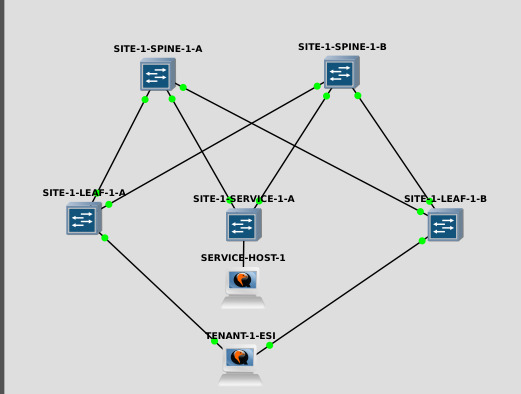

# Simple EVPN lab for illustration and learning purposes #

This lab covers a five node lab running IS-IS underlay, VXLAN with iBGP/EVPN control plane and two PCs.

Document is split in three files:

* [IS-IS underlay](https://github.com/vsi-fi/network-stuff/blob/main/evpn/is-is-underlay.md)
* [iBGP/EVPN control plane for vxlan](https://github.com/vsi-fi/network-stuff/blob/main/evpn/ibgp-overlay.md)
* [Single/multi homed access ports](https://github.com/vsi-fi/network-stuff/blob/main/evpn/evpn-access.md)
