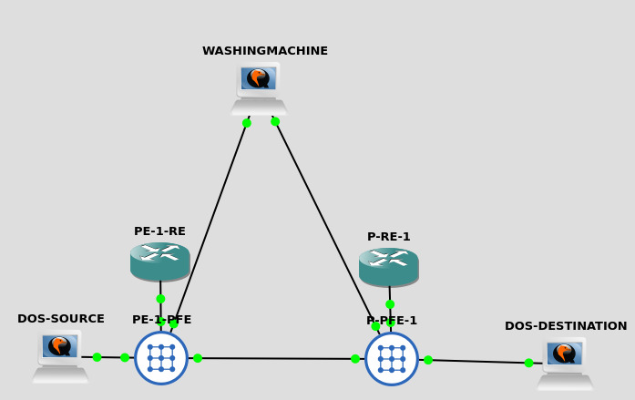

# Simple BGP flowspec lab for illustration and learning purposes #

Goal here was to build a simple DDOS 'mitigation' topology.
This whole thing started with a goal of trying to understand how the flowspec address family could be used to implement rate-limiting everywhere in the network.
Whilst this worked out OK it was difficult not to attempt using flowspec to throw selected traffic over to another routing instance where a 'washing machine' could reside. 

## Building blocks ##

I used the below gear:

* vmx 21.4R1.12 for all the routers
* Three alpine linux hosts to test the 'dos' and to emulate the washing machine



## Configuration ##

Starting with the PE -router receiving the 'dos' -traffic, followed by the P -router where the flowspec rule is defined.

### PE router ###

```
root@PE-1# show protocols 
router-advertisement {
    interface fxp0.0;
}
bgp {
    group IBGP {
        passive;
        family inet {
            unicast;
            flow;
        }
        family inet-vpn {
            unicast;
        }
        export EXPORT-IBGP;
        peer-as 65000;
        local-as 65000;
        allow 10.10.10.0/24;
    }
}
ldp {
    interface ge-0/0/0.0;
}
mpls {
    interface ge-0/0/0.0;               
}
ospf {
    area 0.0.0.0 {
        interface lo0.0 {
            passive;
        }
        interface ge-0/0/0.0 {
            interface-type p2p;
        }
    }
}
lldp {
    interface all;
}
```

Setup basic iBGP session over loopbacks between the routers and included the 'flow' under the ipv4 address family.
I've also enabled basic MPLS signaling to make the washing machine -feature bit more interesting for myself.

Washing machine routing-instance is defined as below:

```
root@PE-1# show routing-instances 
WASHINGMACHINE {
    instance-type vrf;
    routing-options {
        static {
            route 192.168.2.0/24 next-hop 192.168.10.1;
        }
    }
    interface ge-0/0/8.0;
    route-distinguisher 65000:1;
    vrf-import VRF-IMPORT-WASHINGMACHINE;
    vrf-export VRF-EXPORT-WASHINGMACHINE;
    vrf-table-label;
}
```
Static route towards 192.168.2.0/24 points to the 'washing machine' box.
Note the vrf-table-label -knob tells the device to deal with the extra lookup of the IP header to determine the next-hop -address on a multi access interface.


### P router ###

BGP setup is basically the same on the P router as what is on the PE

```
root@P-1# show protocols 
router-advertisement {
    interface fxp0.0;
}
bgp {
    group IBGP {
        family inet {
            unicast;
            flow;
        }
        family inet-vpn {
            unicast;
        }
        export EXPORT-BGP;
        peer-as 65000;
        local-as 65000;
        neighbor 10.10.10.1;
    }
}
ldp {
    interface ge-0/0/0.0;
}
mpls {
    interface ge-0/0/0.0;
}                                       
ospf {
    area 0.0.0.0 {
        interface lo0.0 {
            passive;
        }
        interface ge-0/0/0.0 {
            interface-type p2p;
        }
    }
}
lldp {
    interface all;
}

[edit]
```

Note that the ge-0/0/8.0 is *not* part of the routing-instance WASHINGMACHINE but instead it stays in the default instance:

```
root@P-1# show routing-instances WASHINGMACHINE 
instance-type vrf;
routing-options {
    static {
        route 192.168.2.0/24 next-hop 192.168.20.1;
    }
}
inactive: interface ge-0/0/8.0;
route-distinguisher 65000:1;
vrf-import VRF-IMPORT-WASHINGMACHINE;
vrf-export VRF-EXPORT-WASHINGMACHINE;
vrf-table-label;
```

Flowspec rules are defined in routing-options:

```
root@P-1# show routing-options 
router-id 10.10.10.0;
flow {
    interface-group 66 exclude;
    route ICMP {
        match {
            protocol icmp;
            destination 192.168.2.1/32;
        }
        then {
            inactive: rate-limit 1800;
            routing-instance target:65000:1;
        }
    }
    term-order standard;
}
```

Quite similarly to firewall-filter, one defines the characteristics of the 'attack' attack what what to do with the traffic.
Here, we simply match to the destination address and the ICMP protocol. The then-section allows for rate-limit, discard, (DSCP) marking, sampling etc.
However, this time I wanted to see if i could move the traffic to the routing instance where the washing machine is located, hence we match the route-target of the said VRF.

term-order -knob is interesting as Juniper apparently had implemented flowspec before the standard was complete and Junos defaults to a non-standard rule ordering.

The interface-group -knob is required to exclude the washing machine facing interface from the flow spec processing as per default all the interfaces of a box are getting the filters deployed and this can cause a loop of a kind.

The interface facing the washer is added to interface-group 66:

```
root@P-1# show interfaces ge-0/0/8                    
unit 0 {
    family inet {
        filter {
            group 66;
        }
        address 192.168.20.254/24;
    }
}
```

## Verification ##

Verify that the flowspec rule defined in P -router is deployed on the PE -router:

Interface facing the 'attack' source:
```
root@PE-1# show interfaces ge-0/0/9  
unit 0 {
    family inet {
        filter {
            input CLASSIFIER;
        }
        address 192.168.1.254/24;
    }
}
```
CLASSIFIER filter is defined explicitly on the interface

```
root@PE-1# show firewall family inet filter CLASSIFIER 
term ICMP {
    from {
        protocol icmp;
    }
    then {
        count ICMP;
        forwarding-class ICMP;
    }
}
term DEFAULT {
    then accept;
}
```

It merely sets the forwarding class and counts the matching packets.

Yet, the flowspec rule still is defined and matches:

```
root@PE-1# run show firewall           

Filter: __default_bpdu_filter__                                

Filter: CLASSIFIER                                             
Counters:
Name                                                Bytes              Packets
ICMP                                              1859248                32056

Filter: __flowspec_default_inet__                              
Counters:
Name                                                Bytes              Packets
192.168.2.1,*,proto=1                              421602                 7269

[edit]
```

To confirm, one could try querying the FPC:

```
start shell pfe network fpc0

root@PE-1:~ # cprod -A fpc0 -c "show firewall" | grep flow
   65024  Classic    -         __flowspec_default_inet__
root@PE-1:~ # 

root@PE-1:~ # cprod -A fpc0 -c "show filter index 65024 program"

Filter index = 65024
Optimization flag: 0xf7
Filter notify host id = 0
Pfe Mask = 0xFFFFFFFF
jnh inst = 0x0
Filter properties: None
Filter state = CONSISTENT
term 192.168.2.1,*,proto=1
term priority 0
    protocol  
         1 
        false branch to match action in rule default-term
    destination-address  
        192.168.2.1/32
        false branch to match action in rule default-term

    then
        action next-hop, type (routing-inst)
                WASHINGMACHINE
        count 192.168.2.1,*,proto=1
term default-term
term priority 0

    then
        accept

```

So indeed the filter has been programmed in the PE -router more-or-less as defined in the flow rule on P -router.

I could also verify the behavior by dumping traffic from the washing machine and see that only the expected ICMP traffic was being shoved to the washer whilst everything else remained on the expected path.

