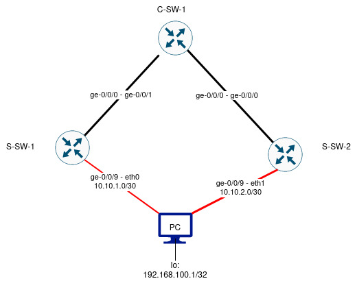

# Multihoming socket based services without proprietary components #

There are quite a few different methods to multihome a server application based on IP.
One quite common option is to assign the IP address on which the server is listening to a LACP bond interface for active-active connectivity to two or more switches.
This works usually quite well but the multi-chassis link-aggregation style black box proprietary components to the network.

One approach to work around this is to use ESI lags with EVPN but this is quite complex for what it provides and the service address is still bound to a single host. 

In this lab I'll try to demonstrate a method to overcome both of the above limitations, produce active-active/multihomed connectivity that also allows for anycast load balancing without any black magic proprietary components.

## Concept and building blocks ##

I want to advertise a "service" address from the server to the network devices instead of directly hosting the service on a physical interface.
To accomplish this I need to:

* Configure the service address to a loopback interface on the host.
* Configure equal cost multi pathing(ECMP) on the host.
* Install routing daemon to the host.
* Configure eBGP session between the host and the network devices.
* Write export policy on the host that sends the route to the network devices.
* Redistribute the received eBGP route to rest of the network using the switches where the server is connected to.

Below is a topology diagram of the setup. Black lines between the devices represent IGP adjacencies whereas the red ones are eBGP.
Host is configured with its service address on a loopback interface.

## Configuration on the host side ##

We need to install software and configure network interfaces on the host.

### Installing required software ###

Alpine Linux has a package manager called "apk" that I'll use to install piece of software called [bird](https://bird.network.cz/).

    apk add bird

### Configuring network interfaces on the host ###

Next, I want to configure the loopback interface with an additional IP address:

    (/etc/network/interfaces)
    auto lo
    iface lo inet static
        address 127.0.0.1
        netmask 255.0.0.0 
    iface lo inet static
        address 192.168.100.1
        netmask 255.255.255.255
 
At this point I rebooted the machine and checked that the IP address is configured:

    pc:~# ip addr|grep 192.168.100.1
        inet 192.168.100.1/32 scope global lo
    pc:~# 

Next order of business was to configure the link networks between the two switches and the host.

This turned out to be surprisingly difficult since for whatever reason I failed to get bird talking BGP when using /31 -networks between the host and the switch.
I did have success with ARP, ping etc. but for some reason bird kept saying "Missing broadcast address for interface".
Anyway, I went ahead with /30s instead:

    (/etc/network/interfaces)
    auto eth0
    iface eth0 inet static
        address 10.10.1.2
        broadcast 10.10.1.3
        netmask 255.255.255.252

    auto eth1
    iface eth1 inet static
        address 10.10.2.2
        broadcast 10.10.2.3
        netmask 255.255.255.252

After a reboot I could see the interfaces correctly configured using ifconfig / ip addr etc. Time to configure bird.

### Configuring bird software ###

Bird is configured (per default) via file /etc/bird.conf

    router id 192.168.100.1;

    protocol kernel {
        #dont remove routes from the table if bird is killed
        persist;
        #scan kernel table for routes to import into bird
        scan time 10;
        #This knob allows for ECMP, e.g. active-active when routes are imported to kernel table
        merge paths on;
        ipv4 {
            import all;  
            export all;
        };
    }

    protocol device {
        interface "eth*";
        scan time 3;
    }

    protocol direct {
        ipv4;
        interface "lo";
        interface "dummy0";
        interface "eth0";
        interface "eth1";
    }

    filter service_address {
        #I want to export only the service route
        if (net = 192.168.100.1/32) then {
            accept;
        }
        else reject; 
    }

    #these are the switches to which the routes should be advertised
    #i am lazy and i'll import whatever the switch decides to give me, in reality filtering is highly recommended
    protocol bgp sw_sw_1 {
        local as 65000;
        neighbor 10.10.1.1 as 65001;
        ipv4 {
            export filter service_address;
            import all;
        };
    }

    protocol bgp sw_sw_2 {
        local as 65000;
        neighbor 10.10.2.1 as 65001;
        ipv4 {
            export filter service_address;
            import all;
        };
    }

Bird has a -p knob to test the config:

    pc:~# bird -p
    pc:~# echo $?
    0
    pc:~# 

In Alpine one can use rc-update to add services so that they run at boot time:

    pc:~# rc-update add bird

At this point I gave the host a reboot and checked that services started as expected.

## Configuring the network devices ##

I used vJunos 23.1R1.8 that seems to think it is a ex9214.

Goal here is to advertise default route to the host(s) and accept the predefined service address via BGP and export it to IGP.

First, I configured the ge-0/0/9 that connects to the host:

    root@S-SW-1> show configuration interfaces ge-0/0/9    
    unit 0 {
       family inet {
            address 10.10.1.1/30;
       }
    }

Then I created the prefix-list with the predefined service address:

    root@S-SW-1> show configuration policy-options prefix-list SERVER-SERVICE-ADDRESS                 
    192.168.100.1/32;

Next step is to create the BGP import policy that accepts only the said service address:

    root@S-SW-1> show configuration policy-options policy-statement IMPORT-BGP-SERVERS 
    term SERVER-SERVICE-ADDRESS {
        from {
            prefix-list SERVER-SERVICE-ADDRESS;
        }
        then {
            preference 90;
            accept;
        }
    }
    then reject;

Notice the **preference 90** which is used so that the device prefers the BGP route over what can be learned from the IGP via the other device connecting to the host.
I also wanted to add an export policy to explicitly announce default to the host:

    root@S-SW-1> show configuration policy-options policy-statement EXPORT-BGP-SERVERS
    term DEFAULT {
        from {
            route-filter 0.0.0.0/0 exact;
        }
        then {
            next-hop self;
            accept;
        }
    }
    then reject;

Followed by the BGP config:

    root@S-SW-1> show configuration protocols bgp    
    group SERVER {
        type external;
        passive;
        import IMPORT-BGP-SERVERS;
        export EXPORT-BGP-SERVERS;
        peer-as 65000;
        local-as 65001;
        neighbor 10.10.1.2;
    }

Then I tested to see if the behavior was the expected.

### Verifying BGP ###

    root@S-SW-1> show bgp summary 

    Warning: License key missing; requires 'bgp' license

    Threading mode: BGP I/O
    Default eBGP mode: advertise - accept, receive - accept
    Groups: 1 Peers: 1 Down peers: 0
    Table          Tot Paths  Act Paths Suppressed    History Damp State    Pending
    inet.0               
                           1          1          0          0          0          0
    Peer                     AS      InPkt     OutPkt    OutQ   Flaps Last Up/Dwn State|#Active/Received/Accepted/Damped...
    10.10.1.2             65000         98         94       0       1       41:43 Establ
      inet.0: 1/1/1/0

    root@S-SW-1> 

So the session is up and running. Next check what is being sent:

    root@S-SW-1> show route receive-protocol bgp 10.10.1.2 

    Warning: License key missing; requires 'bgp' license

    inet.0: 8 destinations, 10 routes (8 active, 1 holddown, 0 hidden)
    Limit/Threshold: 1048576/1048576 destinations
      Prefix                  Nexthop              MED     Lclpref    AS path
    * 192.168.100.1/32        10.10.1.2                               65000 I

    inet6.0: 1 destinations, 1 routes (1 active, 0 holddown, 0 hidden)
    Limit/Threshold: 1048576/1048576 destinations

    root@S-SW-1>

Seems OK on the device side. Lets check the host.

    pc:~# birdc
    BIRD 2.13.1 ready.
    bird> show protocols
    Name       Proto      Table      State  Since         Info
    kernel1    Kernel     master4    up     12:42:43.825  
    device1    Device     ---        up     12:42:43.825  
    direct1    Direct     ---        up     12:42:43.825  
    sw_sw_1    BGP        ---        up     12:42:46.002  Established   
    sw_sw_2    BGP        ---        up     12:42:48.108  Established   
    bird> 

All the protocols are in their expected state.

    bird> show route
    Table master4:
    0.0.0.0/0            unicast [sw_sw_1 12:42:46.002] * (100) [AS65001i]
	    via 10.10.1.1 on eth0
                        unicast [sw_sw_2 12:42:48.108] (100) [AS65001i]
	    via 10.10.2.1 on eth1
    10.10.2.0/30         unicast [direct1 12:42:43.825] * (240)
	    dev eth1
    10.10.1.0/30         unicast [direct1 12:42:43.825] * (240)
	    dev eth0
    192.168.100.1/32     unicast [direct1 12:42:43.825] * (240)
	    dev lo
    bird> 

Seems that the host is receiving the two defaults as expected but lets verify that the ECMP routes are also in kernel:

    pc:~# ip route show default
    default proto bird metric 32 
	    nexthop via 10.10.1.1 dev eth0 weight 1 
	    nexthop via 10.10.2.1 dev eth1 weight 1 
    pc:~# 

Looks good.

### Exporting the service route to IGP ###

In this lab I opted to use OSPF:

    root@S-SW-1> show configuration protocols OSPF   
    area 0.0.0.0 {
        interface ge-0/0/0.0 {
            interface-type p2p;
        }
        interface lo0.0 {
            passive;
        }
    }
    export EXPORT-OSPF;

    root@S-SW-1> 

Notice the **export EXPORT-OSPF** which applies the below policy:

    root@S-SW-1> show configuration policy-options policy-statement EXPORT-OSPF
    term SERVERS {
        from {
            prefix-list SERVER-SERVICE-ADDRESS;
        }
        then accept;
    }
    then reject;

As it is maybe bit unorthodox to export from BGP to OSPF it is maybe reasonable to apply stringent filtering also at this level.

## Verifying ECMP from the network perspective ##

With the below configured on the C-SW-1 we can verify ECMP:

    root@C-SW-1> show configuration policy-options policy-statement ECMP 
    then {
        load-balance per-packet;
    }

    root@C-SW-1> show configuration routing-options forwarding-table 
    export ECMP;

    root@C-SW-1> show route 192.168.100.1 

    inet.0: 8 destinations, 10 routes (8 active, 2 holddown, 0 hidden)
    Limit/Threshold: 1048576/1048576 destinations
    @ = Routing Use Only, # = Forwarding Use Only
    + = Active Route, - = Last Active, * = Both

    192.168.100.1/32   *[OSPF/150] 00:58:45, metric 0, tag 0
                           to 10.1.1.1 via ge-0/0/0.0
                        >  to 10.1.1.2 via ge-0/0/1.0

    root@C-SW-1> 

    root@C-SW-1> show route forwarding-table destination 192.168.100.1 table default
    Routing table: default.inet
    Internet:
    Destination        Type RtRef Next hop           Type Index    NhRef Netif
    192.168.100.1/32   user     0                    ulst  1048578     2
                                  10.1.1.1           ucst      583     4 ge-0/0/0.0
                                  10.1.1.2           ucst      584     3 ge-0/0/1.0

    root@C-SW-1> 

Looks as expected.

## Known issues and further improvements ##

With the above config the host keeps on advertising the service address even if the service is dead.

To remedy this it would be possible to write to simple daemon that periodically polls for the availability of the service and if failure is detected it would pull out the address from the loopback actively forcing the host to withdraw the advertisement.

The above approach not only would allow similar functionality to VRRP but unlike VRRP the service address could also be advertised from a completely different failure domain.
It also lends itself for anycast application. 
